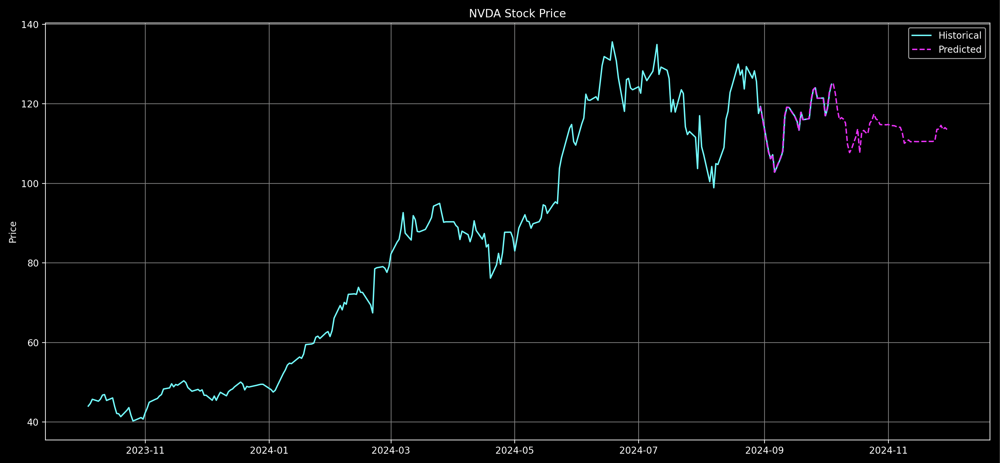

# Stock Predictor

This project uses [XGBoost](https://xgboost.readthedocs.io/en/stable/) to predict stock prices based on historical data. It supports predictions for single dates, date ranges, and multiple tickers.



## Features

- Predict stock prices for a single date or a date range
- Support for multiple stock tickers
- Option to plot predictions (showing past 12 months of historical data)
- Save and load trained models for faster predictions
- Comprehensive error handling and logging

## Setup

1. Ensure you have Python 3.9+ installed.
2. Clone this repository and navigate to the project directory.
3. Run the setup script:

   ```sh
   bash setup.sh
   ```

   This script will:
   - Create a virtual environment
   - Install the required Python packages

4. Activate the virtual environment:

   ```sh
   source venv/bin/activate
   ```

## Usage

You can run the stock predictor with various options:

1. Predict for a single date:

   ```sh
   $ python stock_predictor.py --tickers NVDA --date 2030-01-01
   # Output
   # {
   # "NVDA": {
   #   "2030-01-01": 125.03
   # }
   #}
   ```

2. Predict for a date range (less than 365 days):

   ```sh
   python stock_predictor.py --tickers NVDA --range 2024-10-01,2025-09-30
   ```

3. Predict for multiple tickers:

   ```sh
   python stock_predictor.py --tickers NVDA,MSFT,GOOGL --date 2025-01-01
   ```

4. Plot the predictions (showing past 12 months of historical data):

   ```sh
   python stock_predictor.py --tickers NVDA --range 2025-01-01,2025-12-31 --plot
   ```

5. Save the trained model:

   ```sh
   python stock_predictor.py --tickers NVDA --date 2024-11-01 --save_model model.joblib
   ```

6. Load a saved model:

   ```sh
   python stock_predictor.py --tickers NVDA --date 2024-11-01 --load_model model.joblib
   ```

Replace NVDA, MSFT, GOOGL with the desired stock tickers and adjust the dates as needed.

## Troubleshooting

If you encounter any issues:

1. Ensure you've run the setup script and activated the virtual environment before running the application.
2. Check the logs in `stock_predictor.log` for detailed error messages.
3. Make sure you have a stable internet connection for fetching stock data.

## Disclaimer

This tool is for educational purposes only. Always do your own research and consult with a financial advisor before making investment decisions.
